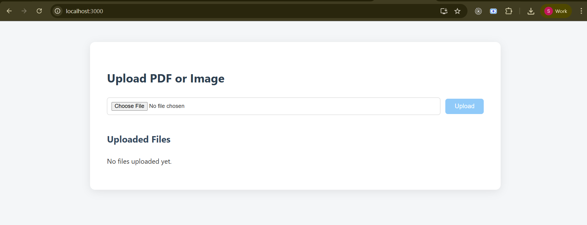
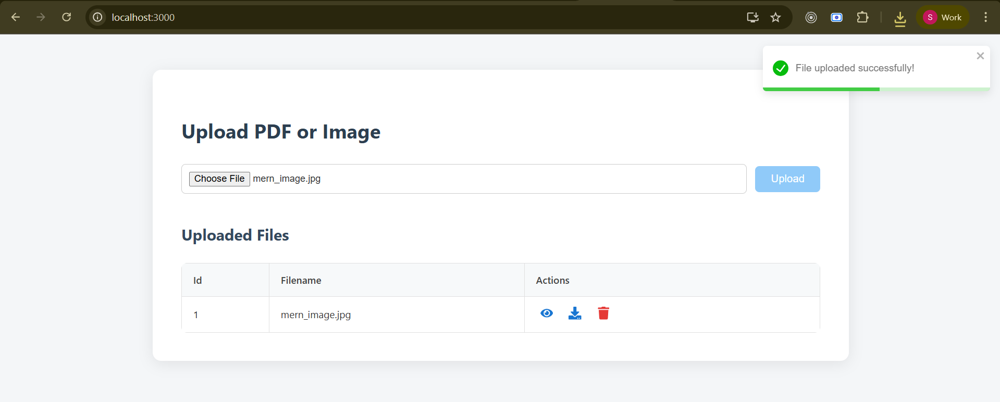
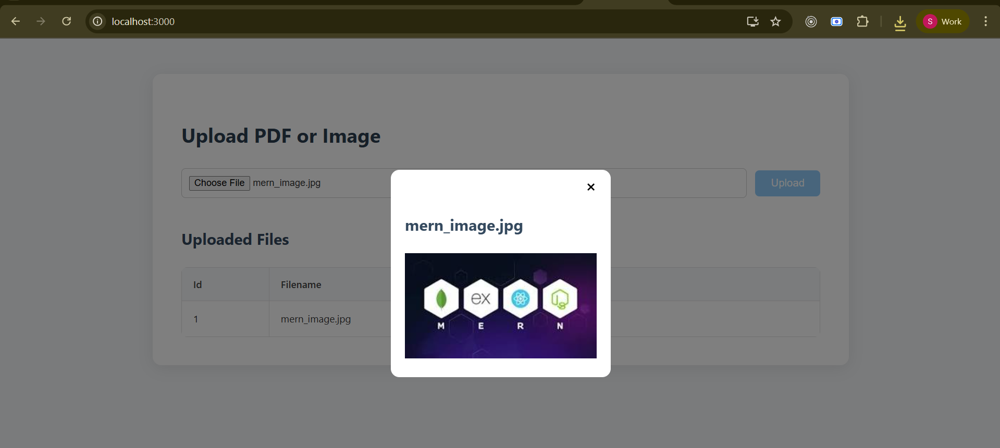
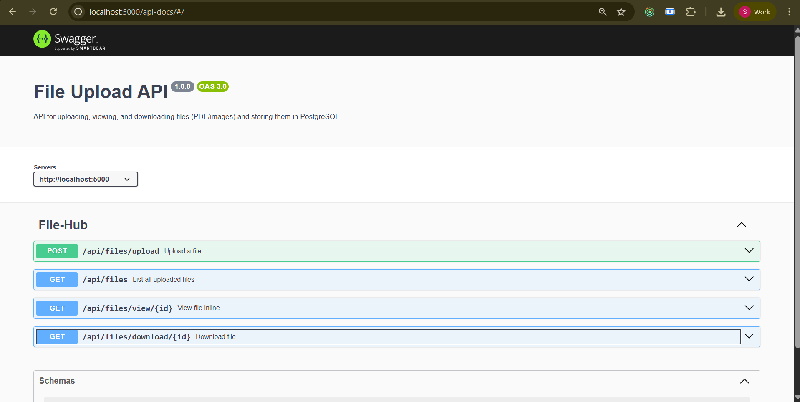

# 📁 FileHub - MERN File Upload & Management System

A full-stack MERN application to **upload**, **preview**, **download**, and **delete** PDF and image files, with files stored directly in **PostgreSQL as binary data (BLOB)** instead of a file system.

---

## 🚀 Features

- Upload PDF and image files.
- Files stored directly as BLOBs in PostgreSQL.
- Preview PDFs and images in a modal.
- Download any uploaded file.
- Delete files with confirmation.
- Responsive, clean UI with toast notifications.
- Swagger API documentation.

---

## 🛠 Tech Stack

### Frontend
- React
- Axios
- React Icons
- React Toastify
- React PDF

### Backend
- Node.js
- Express
- Multer (for in-memory upload)
- pg (PostgreSQL client)
- CORS
- Swagger UI

### Database
- PostgreSQL (Stores filename, mimetype, and binary data)

---

